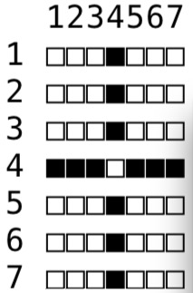

# 题目描述

小明拿到了一个神奇的矩阵图案，其中包含多条宽度为1，水平或者垂直的直线。

小明希望可以快速地数出图案被直线划分为多少块不连通的区域，这里约定两个区域上下左右连通才算作连通。

# 输入输出格式

输入格式：
第一行包括三个数字，分别代表矩阵的列数w（1<=w<=2000000）和行数h（1<=h<=2000000），以及直线的数量n（1<=n<=500）

接下来有n行，每行包括四个整数：x1，y1，x2，y2，分别表示一条直线起点和终点的列号和行号

输出格式：
输出一个数字，表示有多少个区域，行末有换行符。

# 输入输出样例
输入样例#1：
7 7 4
1 4 3 4
5 4 7 4
4 1 4 3
4 5 4 7
输出样例#1：
5